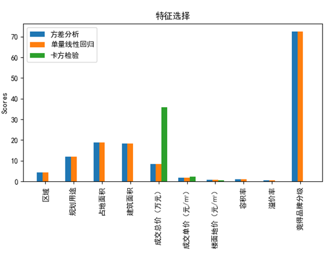
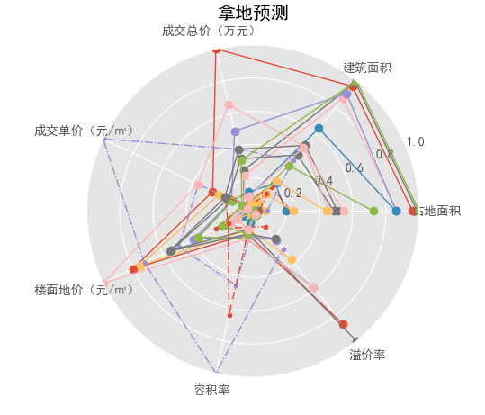
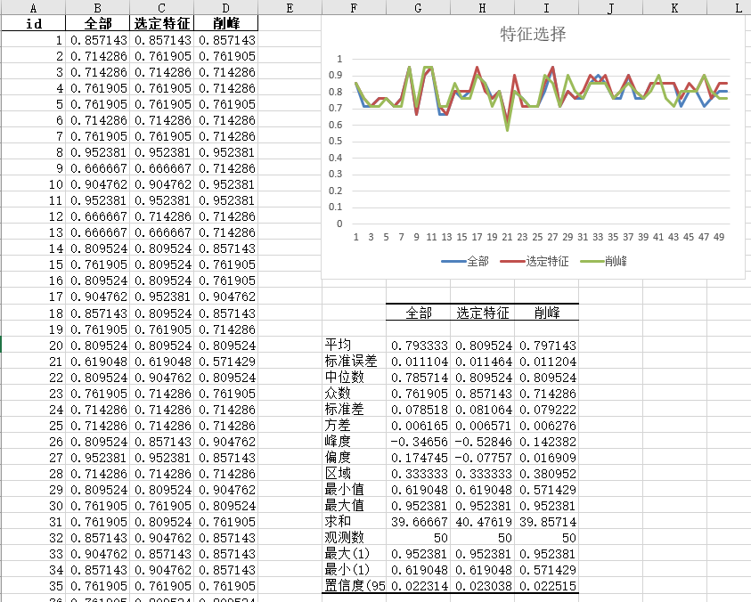
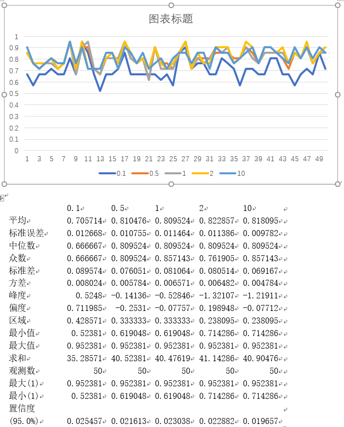

# 地产大亨

## 中国科学院大学，人工智能与应用，项目训练

参与者：程罡、高晓琪、朱魁洪、任飘飘、姜泰

# 开发

## 特征

我们根据相关性选择特征

feagure.py

## 雷达图

使用雷达图表示每个项目的具体情况

radar.py

## 准确度

最后我们改变测试集以及训练集输出准确率

特征准确度
> feagure_accuracy.py

学习力度准确度
> c_accuracy.py

## 语言

python

## 库

sklearn、matplotlib
